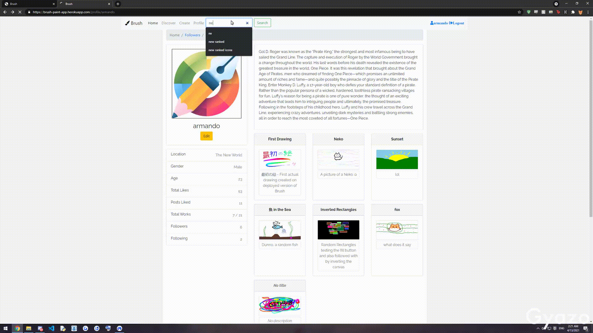
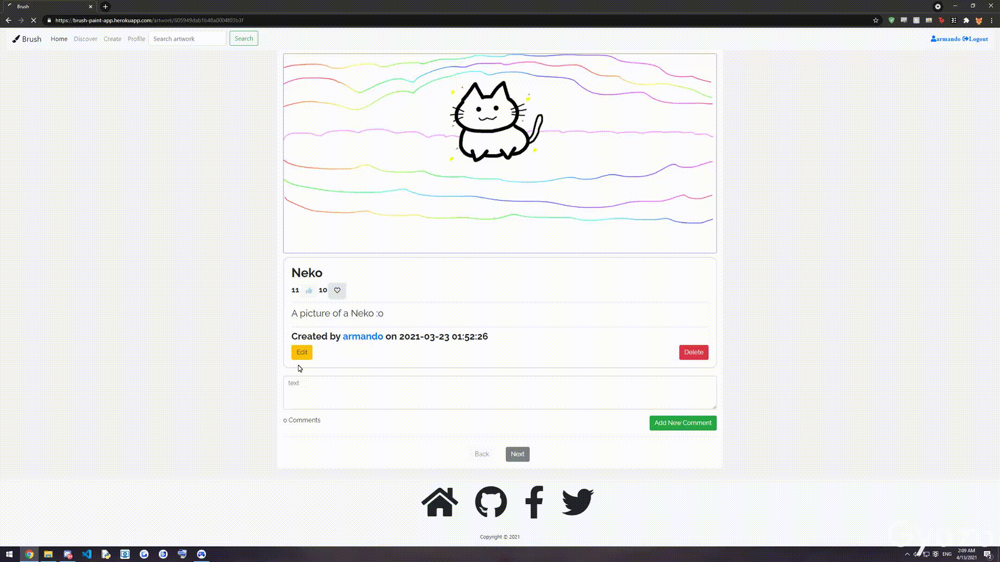
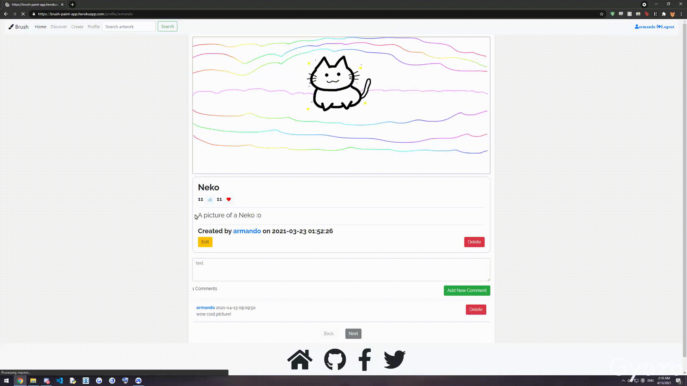
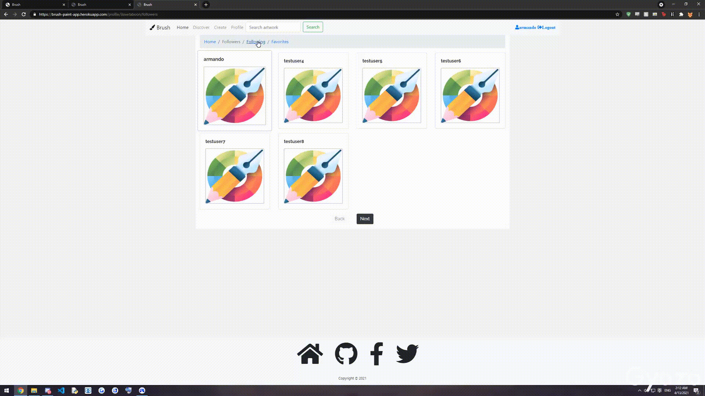
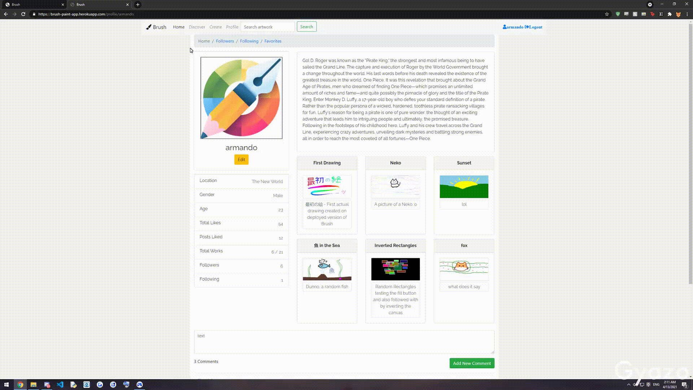
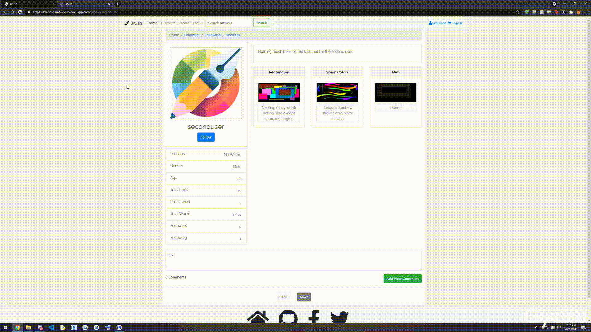

# Brush Description
  - Developed a Full-stack Web application using REST API that allows users to draw their own art on a Javascript canvas, similar to that of a Paint application
  - Users Can:
    - login/register their account
    - create/publish their art(Max 21) to the server
    - comment on other Artwork and other User's Profile
    - follow/unfollow other Users
    - like/favorite Artwork
  - Guests Can:
    - View Homepage/Discover
    - View Artwork/Users/Comments
  
# Technologies Used
- <h4> Programming Languages </h4> 
    <h6> HTML/CSS, Javascript </h6>
- <h4> Tools and Frameworks </h4> 
    <h6> Git, NPM, Node.JS </h6>
  
- <h4> Databases/Other </h4> 
    <h6> MongoDB, MongoDB Atlas, REST API, Heroku </h6> 

# Deployment
  - Deployed using [Heroku](www.heroku.com), a Cloud Application Platform at the following: https://brush-paint-app.herokuapp.com/
  - [MongoDB Atlas](https://www.mongodb.com/cloud/atlas) is used for the Database after transitioning from Localhost

# Demonstration #
  Note: Quality dropped in Gifs 
  
  <h2> Homepage <h2>
  
  
  <h2> Discover <h2>
  

  <h2> Search <h2>
  
  
  <h2> Create <h2>
  
  
  <h2> Artwork Profile </h2>
  
  
  <h2> Profile </h2>
  
   
  <h4> User Tabs </h4>
  
  
  <h4> Followers </h4>
  
  
  <h4> Follow User </h4>
  

# Future Updates #
  - [ ] Additional Paint Application features such as Layers, Custom Effects, etc.
  - [ ] Fill Button to Paint Platform
  - [ ] Friends/Messaging
  - [ ] News Feed
  - [ ] User Search via Searchbar
  - [ ] Profile Picture Update via [multer-gridfs-storage](https://www.npmjs.com/package/multer-gridfs-storage) (Requires More GB on Atlas since Artwork takes a bit of memory)
